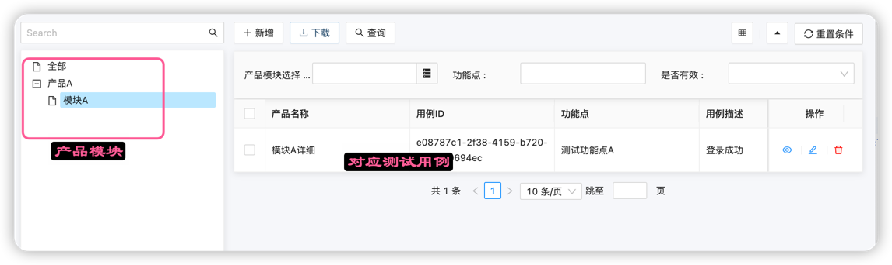

# Test Case管理

测试用例管理是测试平台常见功能，如果只是输入Test Case就是一个非常简单的增删改查页面.
但是因为测试用例的他往往需要和产品，模块关联，所以往往希望测试用例可以展示在对应的产品和模块下面
也就是我们需要实现类似的页面

## 5分钟测试用例管理页面



## 5分钟实现要点

- **还是一个JAVA类**
- 如果完成一个关联树形结构展示页面的增删改查

```java
@Entity
@Erupt(name = "测试用例",
        power = @Power(export = true),
        orderBy = "TestCase.updateTime desc",
        linkTree = @LinkTree(field = "module"))
@Table(name = "test_cases")
public class TestCase extends ModelWithValidFlagVo {

    @ManyToOne
    @JoinColumn(name = "product_id")
    @EruptField(
            views = @View(title = "产品名称", column = "details"),
            edit = @Edit(
                    notNull = true,
                    search = @Search,
                    title = "产品模块选择",
                    type = EditType.REFERENCE_TREE,
                    desc = "动态获取产品",
                    referenceTreeType = @ReferenceTreeType(id = "id", label = "name",
                            pid = "parent.id"))
    )
    private ProductModuleModel module;

    @EruptField(
            views = @View(
                    title = "用例ID"
            )
    )
    private String uuid = UUID.randomUUID().toString();

    @EruptField(
            views = @View(
                    title = "功能点"
            ),
            edit = @Edit(
                    title = "功能点",
                    type = EditType.INPUT, search = @Search, notNull = true, inputType = @InputType(fullSpan = true)
            )
    )
    private String feature;
    @EruptField(
            views = @View(
                    title = "用例描述"
            ),
            edit = @Edit(
                    title = "用例描述",
                    type = EditType.INPUT, notNull = true, inputType = @InputType(fullSpan = true)
            )
    )
    private String summary;

    @EruptField(
            views = @View(
                    title = "用例优先级"
            ),
            edit = @Edit(
                    title = "用例优先级",
                    type = EditType.CHOICE,
                    choiceType = @ChoiceType(
                            fetchHandler = SqlChoiceFetchHandler.class,
                            fetchHandlerParams = {"select distinct code " +
                                    "from master_data where category ='priority' and valid =true"}
                    )
            )
    )
    private String priority = "P2";

    @EruptField(
            views = @View(
                    title = "用例前提条件"
            ),
            edit = @Edit(
                    title = "用例前提条件",
                    type = EditType.HTML_EDITOR,
                    htmlEditorType = @HtmlEditorType(HtmlEditorType.Type.UEDITOR)
            )
    )
    private String precondition;

    @EruptField(
            views = @View(
                    title = "测试步骤"
            ),
            edit = @Edit(
                    title = "测试步骤",
                    type = EditType.HTML_EDITOR,
                    htmlEditorType = @HtmlEditorType(HtmlEditorType.Type.UEDITOR)
            )
    )
    private String steps;
    @EruptField(
            views = @View(
                    title = "用例期望结果"
            ),
            edit = @Edit(
                    title = "用例期望结果",
                    type = EditType.HTML_EDITOR,
                    htmlEditorType = @HtmlEditorType(HtmlEditorType.Type.UEDITOR)
            )
    )
    private String expectedResult;
}
```

具体字段实际上可以自己按照要求添加.